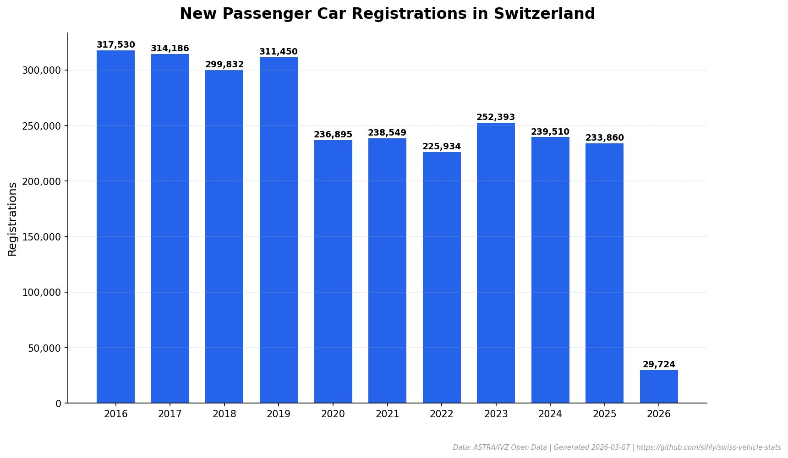
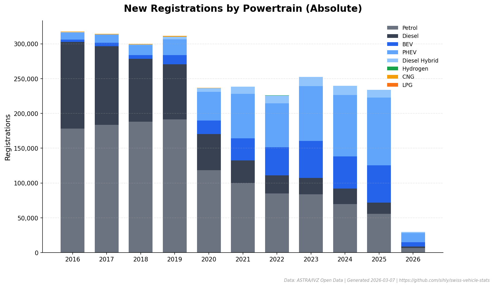
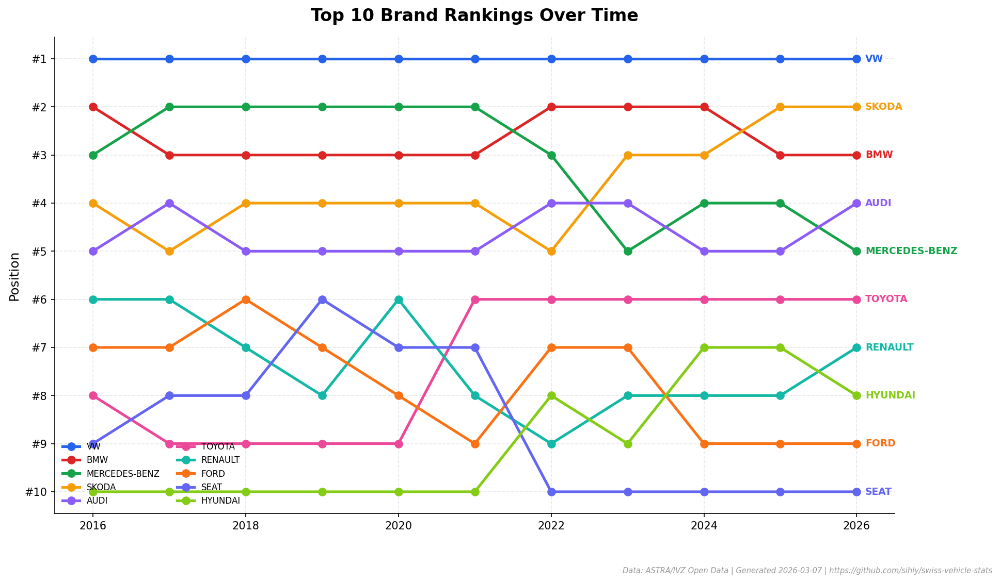
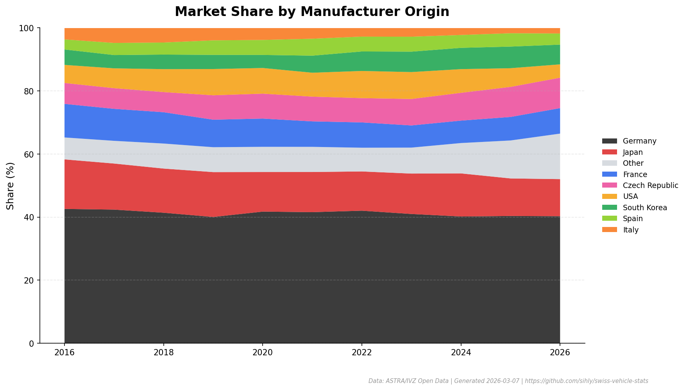
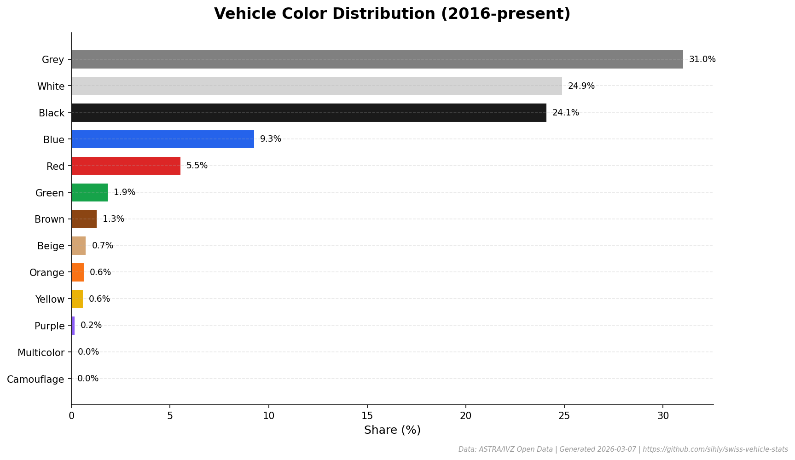
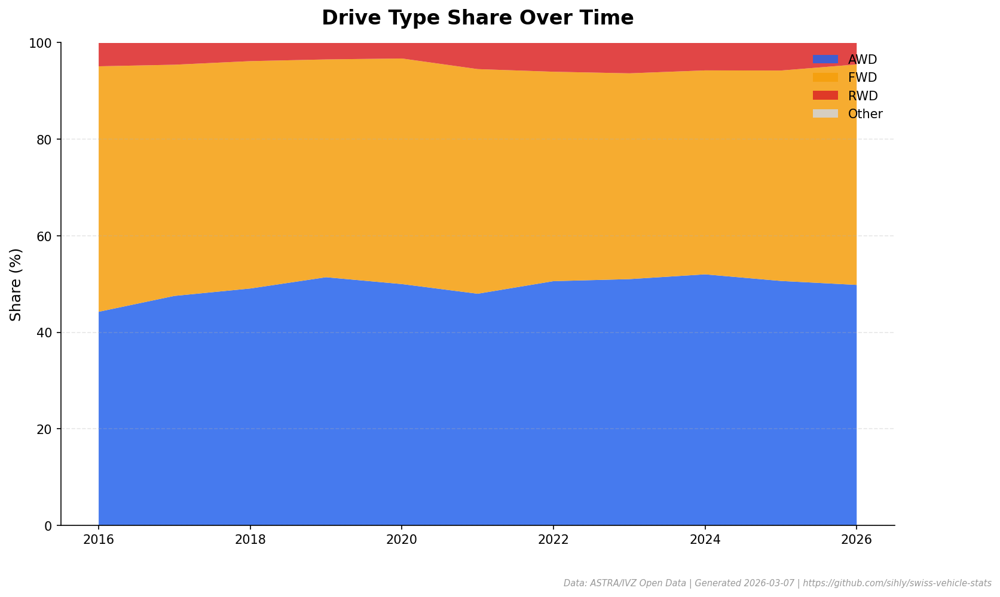

# Swiss Vehicle Registration Analytics

[](LICENSE)

Automated analytics dashboard for Swiss new vehicle registrations, built from [ASTRA/IVZ Open Data](https://opendata.astra.admin.ch/ivzod/1000-Fahrzeuge_IVZ/1200-Neuzulassungen/).

A GitHub Actions pipeline downloads raw registration data monthly, aggregates it, generates charts, and produces a delta report with MoM, YoY, and YTD comparisons.

---

## Dashboard

### New Registrations Trend

Total passenger car registrations per year since 2016. The COVID-19 impact in 2020 is clearly visible, with the market not yet recovering to pre-pandemic levels.



### Powertrain Transition

How Switzerland's new car market is shifting from combustion to electric. Petrol and diesel are shrinking while BEV and PHEV grow year over year.



### Brand Rankings Over Time

Position changes of the top 10 brands. Watch for brands climbing or falling through the ranks across a decade of data.



### Manufacturer Origin

Market share by country of origin over time. Shows the evolution of German, Japanese, South Korean, and emerging Chinese manufacturer presence in Switzerland.



### Vehicle Colors

Color distribution across all registrations since 2016. Grey, white, and black dominate — accounting for over 75% of all new cars.



### Drive Type (AWD/FWD/RWD)

Switzerland's preference for all-wheel drive, likely driven by alpine geography and weather conditions.



---

## How It Works

```
download.py -> process.py -> chart.py -> report.py
```

1. **Download** -- fetches NEUZU.txt (current year) and archive files (2016-2025) from ASTRA
2. **Process** -- parses TSV files with dtype optimization, applies `mappings.yaml` classifications, outputs aggregated CSVs
3. **Chart** -- generates charts with professional styling and dynamic attribution
4. **Report** -- produces a monthly delta report (MoM + YoY + YTD) in markdown

Runs automatically on the 5th of each month via GitHub Actions. Can also be triggered manually.

## Classification

All classifications are driven by `mappings.yaml`:
- **Brand origin** -- brand heritage (Fiat = Italy, even though Stellantis is Dutch-registered)
- **Corporate group** -- parent company (Fiat = Stellantis, Audi = Volkswagen Group)
- **Fuel type** -- normalized powertrain categories
- **Colors** -- German to English translation
- **Drive type** -- AWD/FWD/RWD

Unknown values go to an "Other" bucket and are logged to `warnings.log` for review. Edit `mappings.yaml` to reclassify -- no code changes needed.

## Local Development

```bash
# Install uv (https://docs.astral.sh/uv/)
curl -LsSf https://astral.sh/uv/install.sh | sh

# Install dependencies
uv sync

# Run pipeline
uv run scripts/download.py    # ~1GB total download
uv run scripts/process.py     # ~2-5 min
uv run scripts/chart.py       # ~10 sec
uv run scripts/report.py      # instant
```

## Data Source

**Source:** [ASTRA IVZ Open Data](https://opendata.astra.admin.ch/ivzod/1000-Fahrzeuge_IVZ/1200-Neuzulassungen/1210-Datensaetze_monatlich/)
**Coverage:** 2016-present (~250k-320k passenger cars per year)
**Scope:** Passenger cars (Personenwagen) only

Raw data files (~100MB each) are not committed to this repo. Only aggregated CSVs and charts are tracked in git.

## Data Attribution

Vehicle registration data provided by the Swiss Federal Roads Office (ASTRA).

> Datenquelle: Bundesamt fuer Strassen ASTRA
> Source: Federal Roads Office FEDRO

Data is published under Swiss Open Government Data (OGD) guidelines. Free to use for informational, research, and commercial purposes with attribution. The analytics and charts in this repository are for **informational purposes only** and do not constitute official statistics.

## License

Code: [MIT](LICENSE)

Data: Swiss Federal Roads Office (ASTRA) -- [OGD Terms](https://www.astra.admin.ch/)
